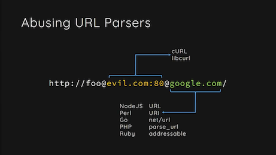
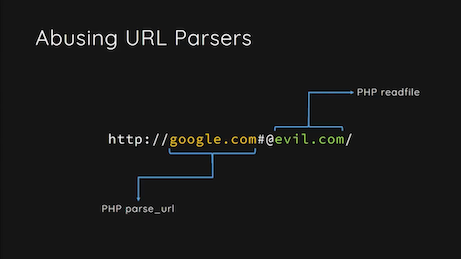

# **WebURL**

[](https://swiftpackageindex.com/karwa/swift-url)
[](https://swiftpackageindex.com/karwa/swift-url)

A new URL type for Swift.

- 🌍 **Compliant** with the [latest URL Standard](https://url.spec.whatwg.org/). WebURL matches how modern browsers interpret URLs.
  
- ⚡️ **Fast**. Tuned for high performance and low memory use.

- 🍭 **Swifty**. The API makes liberal use of generics, in-place mutation, zero-cost abstractions, and other Swift features. It's a big step up from Foundation's `URL`.

- 🧳 **Portable**. The core WebURL library has no dependencies other than the Swift standard library, and no platform-specific behavior.

- 🥽 **Memory-safe**. WebURL uses carefully tuned bounds-checking techniques so it can be both fast _and_ safe.

_(and of course, it's written in **100% Swift**)_.

📚 Check out the [Documentation](https://karwa.github.io/swift-url/main/documentation/weburl/) to learn more 📚
<br/>
<br/>

# Using WebURL in your project

To use this package in a SwiftPM project, you need to set it up as a package dependency:

```swift
// Add the package as a dependency.
dependencies: [
  .package(
    url: "https://github.com/karwa/swift-url",
    .upToNextMinor(from: "0.3.0")
  )
]

// Then add the WebURL library as a target dependency.
targets: [
  .target(
    name: "<Your target>",
    dependencies: [
      .product(name: "WebURL", package: "swift-url")
    ]
  )
]
```

And with that, you're ready to start using `WebURL`:

```swift
import WebURL

var url = WebURL("https://github.com/karwa/swift-url")!
url.scheme   // "https"
url.hostname // "github.com"
url.path     // "/karwa/swift-url"

url.pathComponents.removeLast(2)
url.pathComponents += ["apple", "swift"]
url // "https://github.com/apple/swift"
```

📚 Check out the [Documentation](https://karwa.github.io/swift-url/main/documentation/weburl/) to learn about WebURL's API 📚
<br/>
<br/>

## 🔗 Integration with Foundation

WebURL 0.3.0 includes a library called `WebURLFoundationExtras`, which allows you to construct a `WebURL` from a Foundation `URL` value. To use it, add it to your target dependencies and import the module.

```swift
targets: [
  .target(
    name: "<Your target>",
    dependencies: [
      .product(name: "WebURL", package: "swift-url"),
      // 👇 Add this line 👇
      .product(name: "WebURLFoundationExtras", package: "swift-url")
    ]
  )
]
```

Now you're able to accept URLs using a `Foundation.URL` value while taking advantage of WebURL's web-compatible normalization and fantastic API. Note that this can fail, because Foundation is quite loose about what it accepts as a "URL" and some ambiguous values aren't considered valid by the latest standard, but the things you expect to work will work :)

```swift
import Foundation
import WebURL
import WebURLFoundationExtras

public func processURL(_ url: Foundation.URL) throws {
  guard let webURL = WebURL(url) else {
    throw InvalidURLError()
  }
  // Continue processing using WebURL.
}
```

WebURL -> Foundation.URL conversion will be coming in a later version.
<br/>
<br/>

## 🔗 Integration with swift-system

WebURL 0.2.0 includes a library called `WebURLSystemExtras`, which integrates with `swift-system` and Apple's `System.framework` and allows you to create `file:` URLs from `FilePath`s and vice versa. It has excellent support for both POSIX and Windows paths. Again, to use it, add the target dependency and import the module.

```swift
.target(
  name: "<Your target>",
  dependencies: [
    .product(name: "WebURL", package: "swift-url"),
    // 👇 Add this line 👇
    .product(name: "WebURLSystemExtras", package: "swift-url")
  ]
)
```

And you're good to go!

```swift
import System
import WebURL
import WebURLSystemExtras

func openFile(at url: WebURL) throws -> FileDescriptor {
  let path = try FilePath(url: url)
  return try FileDescriptor.open(path, .readOnly)
}
```
<br/>

## 🧪 async-http-client Port

We have a prototype port of [async-http-client](https://github.com/karwa/async-http-client) which uses WebURL for _all_ of its internal URL handling. If you're using AHC in your server, check it out to take advantage of the latest URL standard and WebURL's improved API. By default, it takes advantage of WebURL's Foundation integration so you can make requests using either type, but it can also be built without any Foundation dependency at all - meaning smaller binaries and faster startup times. It's also a great demonstration of how to adopt WebURL in your library.

We'll be updating the port periodically, so if you wish to use it in an application we recommend making a fork and pulling in changes as you need.

```swift
import AsyncHTTPClient
import WebURL

let client = HTTPClient(eventLoopGroupProvider: .createNew)

func getTextFile(url: WebURL) throws -> EventLoopFuture<String?> {
  let request = try HTTPClient.Request(url: url, method: .GET, headers: [:])
  return client.execute(request: request, deadline: .none).map { response in
    response.body.map { String(decoding: $0.readableBytesView, as: UTF8.self) }
  }
}

let url = WebURL("https://github.com/karwa/swift-url/raw/main/README.md")!
try getTextFile(url: url).wait() // "# WebURL A new URL type for Swift..."
```
<br/>

# 📰 Project Status

WebURL is a complete URL library, implementing the latest version of the URL Standard (as of writing, that is commit `f787850`). It currently does not support Internationalized Domain Names (IDNA), but that support is planned.

It is tested against the [shared `web-platform-tests`](https://github.com/web-platform-tests/wpt/) used by major browsers, and passes all constructor and setter tests (other than those which require IDNA). The library includes a comprehensive set of APIs for working with URLs: getting/setting components, percent-encoding/decoding, reading and writing path components, form parameters, file paths, etc. Each has their own extensive sets of tests in addition to the shared web-platform-tests. The project is regularly benchmarked and fuzz-tested. The benchmark and fuzz-testing suite are available in the `Benchmarks` and `Fuzzers` directories respectively.

Being a pre-1.0 package, the interfaces have not had time to stabilize. If there's anything you think could be improved, your feedback is welcome - either open a GitHub issue or post to the [Swift forums](https://forums.swift.org/c/related-projects/weburl/73).

Prior to 1.0, it may be necessary to make source-breaking changes. 
I'll do my best to keep these to a minimum, and any such changes will be accompanied by clear documentation explaining how to update your code.

## 🗺 Roadmap

Aside from stabilizing the API, the other priorities for v1.0 are:

1. `Foundation` interoperability.

   Foundation's `URL` type is the primary type used for URLs on Swift today, and Foundation APIs such as `URLSession` are critical for many applications, in particular because of their system integration on Apple platforms.

   We will provide a compatibility library which allows these APIs to be used together with `WebURL`.

2. More APIs for query parameters.

   A URL's `query` component is often used as a string of key-value pairs. This usage appears to have originated with HTML forms, and WebURL has excellent support for this via its `formParams` view, but popular convention is also to use keys and values that are _not strictly_ form-encoded. This can lead to decoding issues.

   Additionally, we may want to consider making key lookup Unicode-aware. It makes sense, but AFAIK is unprecedented in other libraries and so may be surprising. But it does make a lot of sense. Feedback is welcome.

Looking beyond v1.0, the other features I'd like to add are:

3. Better APIs for `data:` URLs.

   WebURL already supports them as generic URLs, but it would be nice to add APIs for extracting the MIME type and decoding base64-encoded data.
   
4. APIs for relative references.

   All `WebURL`s are absolute URLs (following the standard), and relative references are currently only supported as strings via the [`WebURL.resolve(_:)` method](https://karwa.github.io/swift-url/main/documentation/weburl/weburl/resolve(_:)).

   It would be valuable to a lot of applications (e.g. server frameworks) to add a richer API for reading and manipulating relative references, instead of using only strings. We may also want to calculate the difference between 2 URLs and return the result as a relative reference.
  
5. Support Internationalized Domain Names (IDNA).

   This is part of the URL Standard, and its position on this list shouldn't be read as downplaying its importance. It is a high-priority item, but is currently blocked by other things.

   There is reason to hope this may be implementable soon. Native Unicode normalization was [recently](https://github.com/apple/swift/pull/38922) implemented in the Swift standard library for String, and there is a desire to expose this functionality to libraries such as this one. Once those APIs are available, we'll be able to use them to implement IDNA.
<br/>
<br/>

# 💝 Sponsorship

I'm creating this library because I think that Swift is a great language, and it deserves a high-quality, modern library for handling URLs. It has taken a lot of time to get things to this stage, and there is an exciting roadmap ahead. so if you (or the company you work for) benefit from this project, do consider sponsoring it to show your support and encourage future development. Maybe it saves you some time on your server instances, or saves you time chasing down weird bugs in your URL code.
<br/>
<br/>

# ℹ️ FAQ

## How do I leave feedback?

Either open a GitHub issue or post to the [Swift forums](https://forums.swift.org/c/related-projects/weburl/73).

## Are pull requests/code reviews/comments/questions welcome?

Most definitely!

## Is this production-ready?

Yes, it is being used in production.

The implementation is extensively tested (including against the shared `web-platform-tests` used by the major browsers, which we have also made contributions to, and by fuzz-testing), so we have confidence that the behavior is reliable.

Additionally, the benchmarks package available in this repository helps ensure the performance is well-understood, and that operations maintain a consistent performance profile. Benchmarks are run on a variety of devices, from high-end modern x64 computers to the raspberry pi.

## Why the name `WebURL`?

1. `WebURL` is short but still distinct enough from Foundation's `URL`.

2. The WHATWG works on technologies for the web platform. By following the WHATWG URL Standard, `WebURL` could be considered a kind of "Web-platform URL".

## What is the WHATWG URL Living Standard?

It may be surprising to learn that there many interpretations of URLs floating about - after all, you type a URL in to your browser, and it just works! Right? Well, sometimes...

URLs were first specified in 1994, and were repeatedly revised over the years, such as by [RFC-2396](https://datatracker.ietf.org/doc/html/rfc2396) in 1998, and [RFC-3986](https://www.ietf.org/rfc/rfc3986.txt) in 2005. So there are all these different standards floating around - and as it turns out, they're **not always compatible** with each other, and are sometimes ambiguous.

While all this was going on, browsers were doing their own thing, and each behaved differently to the others. The web in the 90s was a real wild west, and standards-compliance wasn't a high priority. Now, that behavior has to be maintained for compatibility, but having all these different standards can lead to severe misunderstandings and even exploitable security vulnerabilities. Consider these examples from [Orange Tsai's famous talk](https://www.youtube.com/watch?v=voTHFdL9S2k) showing how different URL parsers (sometimes even within the same application) each think these URLs point to a different server.

 

_Images are Copyright Orange Tsai_

So having all these incompatible standards is a problem. Clearly, there was only one answer: yet another standard! 😅 But seriously, this time, it had to have browsers adopt it. For a URL standard, matching how browsers behave is kinda a big deal, you know? And they're not going to break the web, so it needs to document what it means to be "web compatible". It turns out, most URL libraries already include ad-hoc collections of hacks to try to guess what web compatibility means.

This is where the WHATWG comes in to it. The WHATWG is an industry association led by the major browser developers (currently, the steering committee consists of representatives from Apple, Google, Mozilla, and Microsoft), and there is high-level approval for their browsers to align with the standards developed by the group. The latest WebKit (Safari 15) is already in compliance. The WHATWG URL Living Standard defines how **actors on the web platform** should understand and manipulate URLs - how browsers process them, how code such as JavaScript's `URL` class interprets them, etc. And this applies at all levels, from URLs in HTML documents to HTTP redirect requests. This is the web's URL standard. 

By aligning to the URL Living Standard, this project aims to provide the behavior you expect, with better reliability and interoperability, sharing a standard and test-suite with your browser, and engaging with the web standards process. And by doing so, we hope to make Swift an even more attractive language for both servers and client applications.